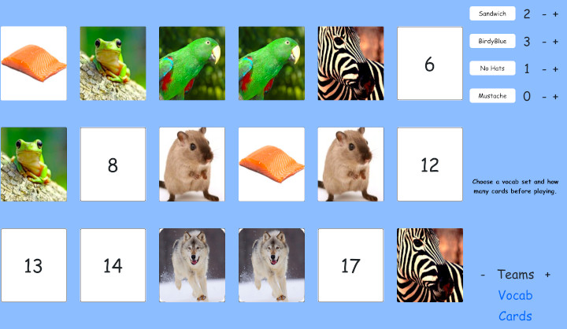

# [Match Game](https://teflassistant.com/match-game/)
A vocabulary building game for elementary school English lessons.

## Purpose/Goal
To have a match game where I can control the images and vocabulary used in the classroom.

## Operation

## Tech/Libraries Used
* HTML
* CSS
* JavaScript
* React
* ReactRouter
* Bootstrap

## Problems/Solutions
* This app is not meant for small screens. Maybe I will adapt for small screens later, but that is not a high priority for me now.

## More Information
N/A
