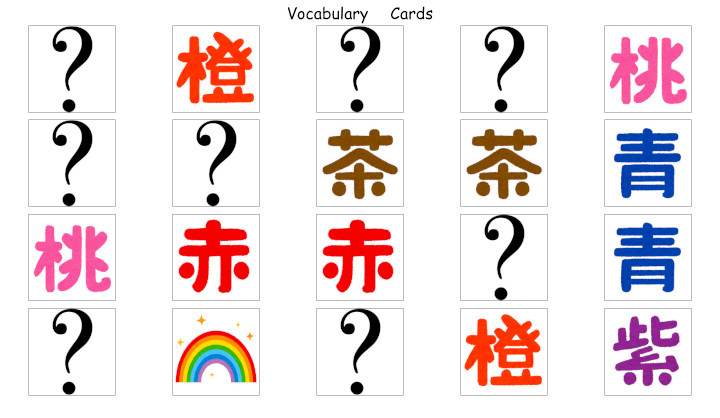

# Match Game
A vocabulary building game for elementary school English lessons.

## Purpose/Goal
To have a match game where I can control the images and vocabulary used in the classroom.

## Operation

## Tech/Libraries Used
* HTML
* CSS
* JavaScript
* React
* ReactRouter
* Bootstrap

## Problems/Solutions
N/A

## More Information
N/A
